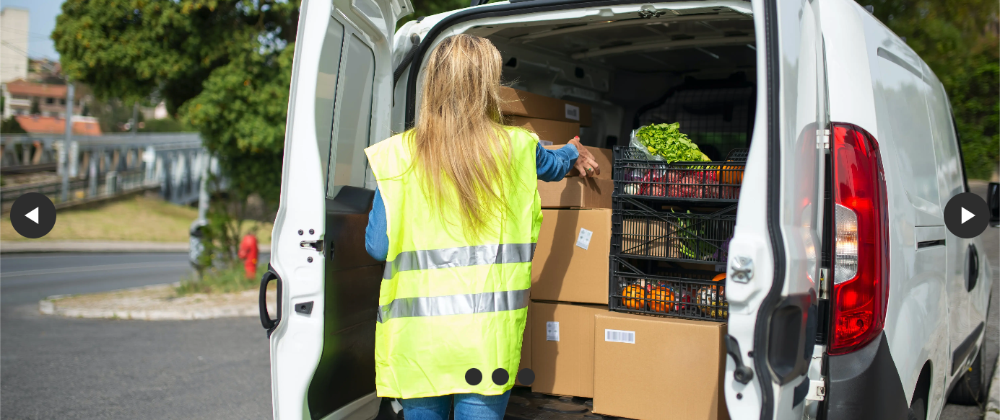
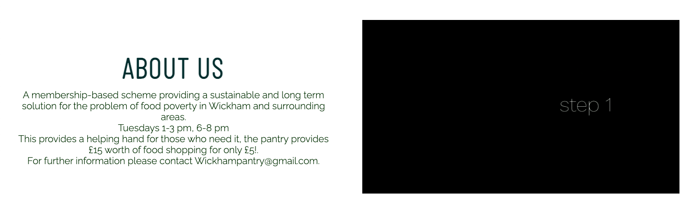
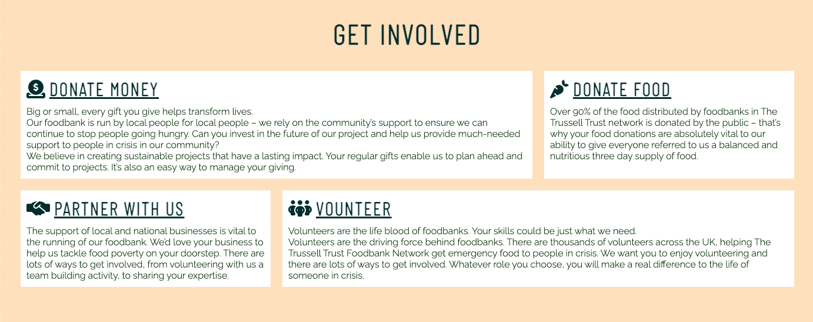
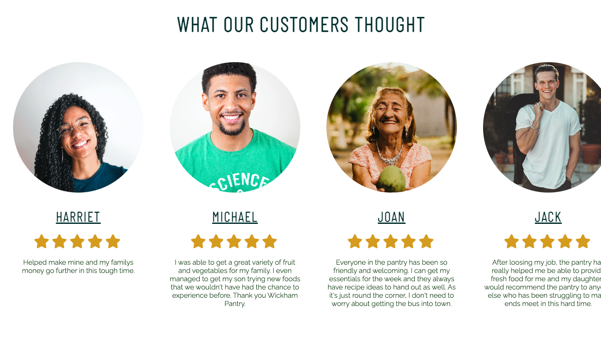
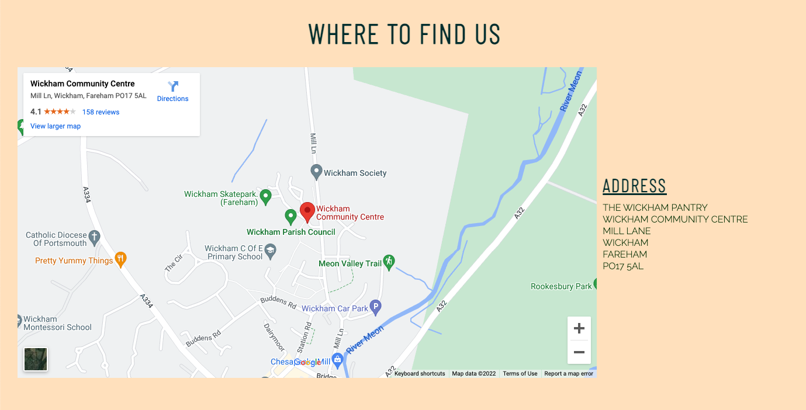
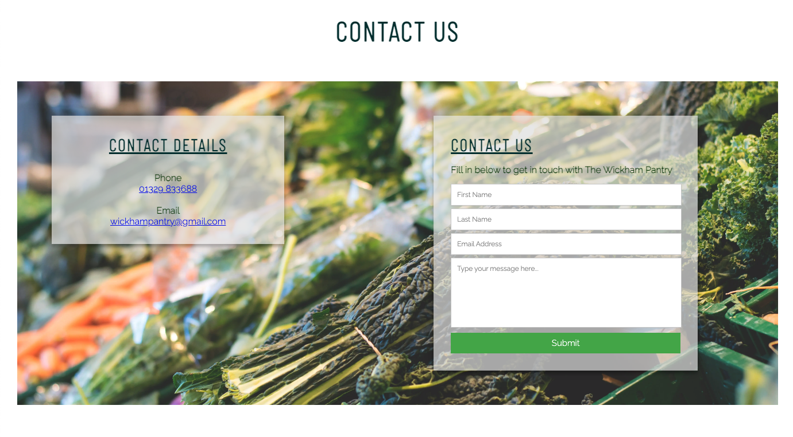

<h1 align="center">Project One - Wickham Pantry Charity</h1>

This is the main charity website for Wickham Pantry Charity. It is designed to be responsive and accessible on a range of devices, making it easy to navigate for potential voluteeners, partners and anyone looking to donate or visit the Pantry. 

<h2 align="center"> IMAGE HERE</h2>

<h2>Feautures</h2>

<h3>Exisiting Feautures</h3>
<ul>
<li><b>Header</b></li>

Featured at the top of the page is a header with the Wickhanm Pantry logo in the top left corner. this logo also will allow you to reload the index.html page.

</ul>

<ul>
<li><b>The landing page images</b>
</li>

The landing page images include 3 photographs that automatically scroll through one at a time. 

This sections gives a cleae insight into what the pantry is about and grabs the users attention.

</ul>

<ul>
<li><b>Navigation</b>
</li>

This navigation section is fully responsive, and includes links to all the different sections of the home page. 

This section will allow users to easily navigate across the page without having to scroll down the entire page.

</ul>

<ul>
<li><b>About Us</b>
</li>

The About Us section will allow the user to see a breif introduction into how the pantry works. It also has a video with full audio and visuals to show a step by step guide on how to use the pantry before users decide whether its right for them. 

This encourage the user to continue scrolling and see if they would like to get involved.

</ul>

<ul>
<li><b>Get Involved</b>
</li>

This section will allow the user to see exactly how they can get involved with the pantry if they do not want to be a user, this section tells them about how they can donate money, food, partner with us and volunteer

</ul>

<ul>
<li><b>What Our Customers Thought</b>
</li>

This section is full of customer images, ratings and testimonials from customers of the pantry. This is where the user can see how the pantry has made a difference to the local people of Wickham, who may be struggling financially 

This section is also full scrollable on all devices so will be updated as new reviews and testimonials come in.

</ul>

<ul>
<li><b>Where To Find Us</b>
</li>

This section includes a Google Maps which shows the exact location of the pantry so users can see whrer it is, but also has the address on the right hand side for ease. 

</ul>

<ul>
<li><b>Contact Us</b>
</li>

This section has the contact information for the pantry, including a phone number which is clickable so when you are looking on the site on a mobile you can make a direct call, and also an email address, that again if you click on you can email the pantry direct. 

This section also includes a contact us form where you can leave your name, email address and message if you do not want to call or email the pantry direct.

</ul>

<ul>
<li><b>Footer</b>
</li>

The footer section includes link to the pantrys social media where users can keep up to date with the katest news and recipes that the pantry has been posting

The footer is valuable to the user as it encourages them to keep connected via social media.

</ul>

<h2>Testing</h2>

Throughout making this website for The Wickham Pantry, I have come up with many obstacles that I have had to test and find new ways to kee my site looking its best and responsive. 

I have tested my site across a varied number of different site, sarafi, chrome etc and screen sizes, TV screens down to small mobile devices.

Some testing that I have had to do was to make sure that my heading section was not getting lost and covered by the main images on the page. When full screen this was correct but when going to smaller screens this wasn't working. I had to change some of the positioning of the carousel and the header for this to become fully responsive. Also when on smaller screens I decided to make the carousel scale down otherwise it was covering the majority of a mobile device screen. 

I have also made the smaller mobile screens center aligned as this appears to be more user friendly and visably pleasing. 

<h2>Validator Testing</h2>
<b>HTML</b>
<li>No errors were returned when passing through the official W3C validator</li>
<b>CSS</b>
<li>No errors were found when passing through the official (Jigsaw) validator</li>

<h2>Unfixed Bugs</h2>

One unfixed bug woukd be the menu section on the site. I would like to be able to make this into a Hamburger menu when on smaller devices but it was not responsive to being in the top right corner and when opened was hidden under the carousel. For the moment the menu is resposive by going into a vertical list when on smaller mobile devices.

<h2>Deployment</h2>
The site was deployed to GitHub pages. The steps to deploy are as follows:
In the GitHub repository, navigate to the Settings tab
From the source section drop-down menu, select the Master Branch
Once the master branch has been selected, the page will be automatically refreshed with a detailed ribbon display to indicate the successful deployment.
The live link can be found here - https://nikkilemon.github.io/wickham-pantry/ 

<h2>Credit</h2>
<b>Content</b>
<li>The Icons in the Get Involved section and Footer where from Font Awesome website.</li>
<li>Information about getting involved from Portsmouth Bank website.</li>
<b>Media</b>
<li>The images used on this home page where from pexels.com</li>

<h2>Wireframes</h2>
    - Home Page & Mobile Wireframe - <a href="assets/wireframes/wickham-pantry.pdf" download>Click to Download</a>